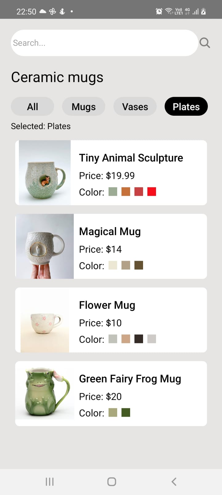
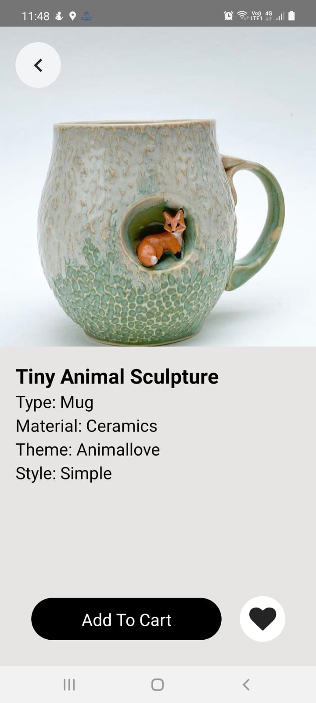

## Smart Cup App Concept
The idea of the app has been influenced by a design done by Tinatin Rogava posted on [dribbble](https://dribbble.com/shots/16373391-Smart-Cup-App-Concept).

The design is clean and looks like something that can be achieved using tailwind css. I'm learning desing using tailwindcss and that's why I thought of using it together with React Native Elements

>This is another self challenge to try and use RN skills learnt.

## How to run the app

Move into the app
```
$ cd <project>
```

Start metro server on one tab

```
$ react-native start --port=8082
```

OR

```
$ yarn start --port=8082 --reset-cache
```

*NB:* Make sure you have a device connected e.g. Android phone

To check:


   ```
   $ adb devices

   List of devices attached
   14ed2fcc device         # Physical device
   ```

Run app on Android phone

```
$ npx react-native run-android --port=8082
```

## Original design Vs Complete app


<div>
  
  
</div>

## Remarks
Much appreciation to [Tinatin Rogava](https://dribbble.com/TinatinnRogava) for her awesome work.

The app design and development is still in progress until it comes closer to the original design